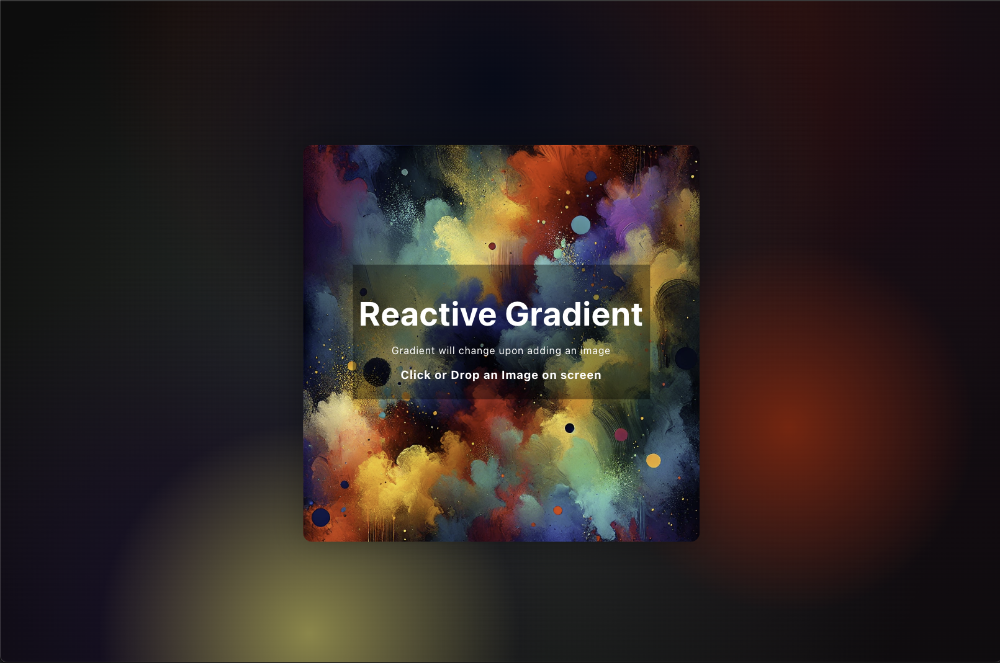

# Reactive Gradient Image Analyzer



## Overview
This project is a **React-based image analyzer** that generates a dynamic **splotchy gradient background** based on the most dominant and unique colors extracted from an uploaded image. Users can **drag and drop** or **click to upload** an image, and the app will analyze its colors and apply them to the background in a **visually appealing gradient effect**.

## Features
- **Image Uploading**: Supports drag-and-drop or file selection.
- **Color Analysis**: Extracts the most popular and unique colors from the image.
- **Gradient Generation**: Creates a **splotchy gradient** using detected colors.
- **Interactive UI**: Click anywhere to trigger file selection.
- **Live Updates**: Background dynamically changes upon image upload.

## Technologies Used
- **React.js** - Core framework
- **HTML5 Canvas API** - Image processing & color analysis
- **CSS3** - Styling and animations
- **JavaScript (ES6)** - Core logic and interactivity

## Installation
To run this project locally, follow these steps:

### 1️⃣ Clone the repository
```sh
git clone https://github.com/your-repo/reactive-gradient.git
cd reactive-gradient
```

### 2️⃣ Install dependencies
```sh
npm install
```

### 3️⃣ Start the development server
```sh
npm start
```
The application will run on `http://localhost:3000`.

## Usage
1. Click anywhere on the screen or **drag and drop** an image.
2. The image will be processed, and a **unique background gradient** will be generated.
3. Enjoy the dynamically changing background based on your uploaded image!

## Project Structure
```
├── src
│   ├── App.js        # Main component
│   ├── App.css       # Stylesheet
│   ├── Assets
│   │   └── Images
│   │       └── Main.png  # Default image
│   ├── index.js      # React entry point
├── public
│   ├── index.html    # Main HTML template
├── package.json      # Dependencies and scripts
└── README.md         # Documentation
```

## Future Enhancements
- **Allow users to adjust grid size** for finer color analysis.
- **Add image filters** for better visualization.
- **Provide an option to download the generated gradient** as a CSS file.

## License
This project is licensed under the **MIT License**.

---
Happy coding! 🚀

